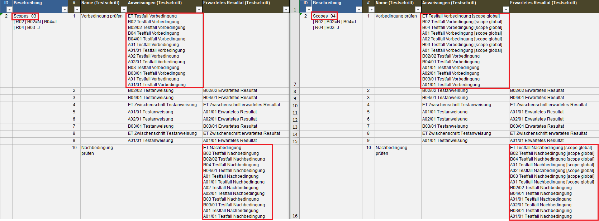

= lfet-examples-scope-de

Die Bestimmung der Reihenfolge von Testanweisungen ist ein wichtiges Thema bei der Testfallgenerierung.

[TIP]
Siehe auch Dirk's *_Testing-Tutorial 2 - Reihenfolge der Testschritte festlegen_*: +
_https://www.youtube.com/playlist?list=PLyKvkX05HliLdHk2Bh1vR6of2yVvubfYO_

Aus diesem Grunde sollen die entsprechenden Kapitel im Handbuch verbessert und durch Demo-ET's und ggf. auch Videos ergänzt werden.

Die Beispiele in diesem Projekt dienen dazu

* systematisch die Wirkung der beiden optionalen, kombinierbaren Testschritteigenschaften *_scope_* und *_sid_* zu visualisieren
* Testkonstellationen für Unit-Tests zu liefern

Wir beginnen auf ganz einfachem Niveau und steigern die Komplexität langsam Schritt für Schritt (Regelgruppen, Scopes, SIDs, etc.).

Die Wirkung der scope- und sid-Angaben lassen sich am besten durch Vergleichen der generierten Excel-Testfälle nachvollziehen, hier ein Beispiel:

Ab Entscheidungstabelle *_Scopes_04_* (Start der Verwendung von scope=global) ist *_LF-ET 2.2.1 230325a_* notwendig.

* *_https://lohrfink.de/lfet/lfet_230325a_upd.zip_* +
(Update, verwendbar für Installationen ab 230323a) +
* *_https://lohrfink.de/lfet/lfet_230325a_inst.zip_* +
(Vollinstallation)

== Aktuelle Implementierung in LF-ET

=== Aufbau eines Testfalles

* *_Testfall-Vorbedingung_*
** alle Vorbedingungen mit *_scope=global und sid_*
** alle Vorbedingungen mit *_scope=global ohne sid_*
** alle Vorbedingungen *_ohne scope_* (d.h. scope rule)

* Alle *_Testanweisungen, Zwischenschritte und erwartete Ergebnisse_*
** alle mit *_scope=global und sid_*
** alle mit *_scope=global ohne sid_*
** alle *_ohne scope_* (d.h. scope rule)

* *_Testfall-Nachbedingung_*
** alle Nachbedingungen mit *_scope=global und sid_*
** alle Nachbedingungen mit *_scope=global ohne sid_*
** alle Nachbedingungen *_ohne scope_* (d.h. scope rule)

=== SID - Sequenz-ID oder Sort-ID

Die SID ist eine optionale Testschritt-Eigenschaft, mit der die "normale" Reihenfolge der Testschritte in einem Testfall übersteuert werden kann.

Die "normale" Reihenfolge der Testschritte ist die Reihenfolge, mit der die Testschritte bei der Berechnung durchlaufen wurden.

*_Wenn_* aus der *_SID_* ein Integer-Wert abgeleitet werden kann +
* dann wird dieser intern 10-stellig mit führenden Nullen verwendet +
* sonst wird der Wert so verwendet, wie er definiert ist
